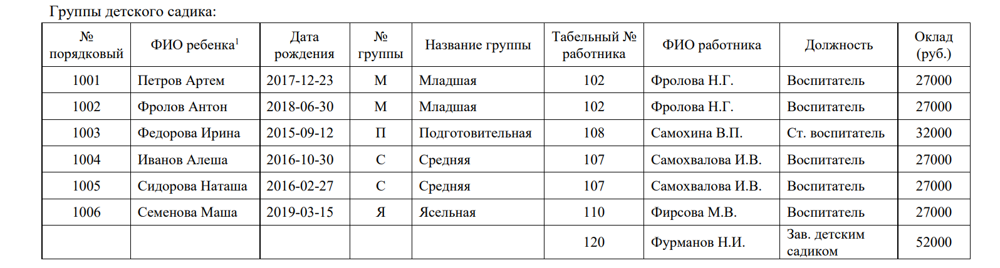

# Задание №1: Создать в MySQL базу данных «Библиотека. Книговыдача», состоящую из 4-х связанных таблиц

[^1]: 1.	Создать представленные выше таблицы, индексы по первичным и родительским ключам.
[^2]: 2.	С помощью Workbench MySQL по полученным таблицам создать ER диаграмму.
[^3]3.	INSERT INTO – заполнить полученные таблицы данными.
[^4]4.	INSERT INTO – заполнить таблицу «Экземпляры книг» данными из таблицы «Экземпляры книг1»
[^5]5.	DROP – удалить таблицу «Экземпляры книг1».
[^6]6.	UPDATE – изменить в поле «Цена» таблицы «Книги», стоимость каждой книги на 20%.
[^7]7.	DELETE – удалить книгу, ISBN которой равен 675-3-423-00375 из всех таблиц.
[^8]8.	SELECT – вывести на экран записи, содержащие следующие поля: ISBN, ФИО автора, Название книги, Цена для книг, цены которых находится в диапазоне от 400 до 700 рублей.
[^9]9.	SELECT – после задания № читательского билета, вывести на экран записи, содержащие следующие поля: № читательского билета, ФИО читателя, № группы, ISBN, Название книги, Цена по каждой книге, взятой этим читателем.
[^10]10.	SELECT – вывести на экран записи, содержащие следующие поля: ISBN, ФИО автора, Название книги, Цена, для книг которые находятся в библиотеке.
[^11]11.	SELECT – вывести на экран записи, содержащие следующие поля: № читательского билета, ФИО читателя, № группы, Количество книг, которое находятся у этого читателя на руках, если это количество не меньше двух.
[^12]12.	SELECT – вывести на экран запись – ISBN, ФИО автора c максимальным количеством экземпляров книг в библиотеке.
[^13]13.	SELECT – вывести на экран записи, содержащие следующие поля: ISBN, ФИО автора, Название книги, Цена, Количество читателей, которые взяли эту книгу.
[^14]14.	SELECT – вывести на экран запись, содержащую следующие поля: № читательского билета, ФИО читателя, № группы, Количество взятых книг для читателей, которые взяли их максимальное количество.

#Задание №2: Создать базу данных «Детский садик», которая содержит таблицы, удовлетворяющие условиям нормализации (3НФ)

